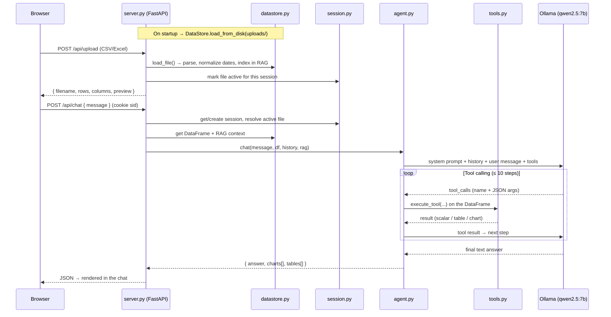

# 📊 AI Data Analyst Agent

A local, privacy-first **conversational data analyst**. Upload a CSV or Excel
file and chat with it in natural language — ask questions, compute statistics,
generate charts, and build derived tables. Every answer is grounded in **real
pandas execution** (the model never guesses numbers), and **all inference runs
locally** through [Ollama](https://ollama.com/) — no cloud APIs, no data leaving
your machine.

---

## ✨ Features

- 📂 **CSV / Excel upload** straight from the browser, with size limits and
  filename sanitization.
- 🤖 **Tool-calling agent** — the LLM calls real tools (pandas, matplotlib) to
  compute results; it is *forced* to call a tool before answering, so responses
  are never hallucinated.
- 📈 **Chart generation** — bar, pie, line, scatter, histogram, heatmap, box and
  area charts, rendered in the UI. High-cardinality charts are automatically
  capped to **top‑12 + “Others”** and given a **color→label legend** so they stay
  readable.
- 🗂️ **Derived tables** — filter, aggregate, rank or pivot data and view the
  result as an interactive table in the chat.
- 🔍 **Schema-aware RAG** — ChromaDB + Sentence-Transformer embeddings index each
  dataset’s schema, statistics, samples and distributions; relevant context is
  injected into the prompt on every query (with a keyword fallback if ChromaDB
  isn’t available).
- 👥 **Per-session isolation** — each browser session (cookie-based) has its own
  active file and conversation history; datasets are a shared library.
- 💾 **Dataset persistence** — uploaded files are reloaded and re-indexed on
  startup, so they survive a server restart without re-uploading.
- 🧠 **Conversation memory** — the agent remembers the last 8 turns *per session*.
- 🔒 **Sandboxed execution** — model-generated code runs through a restricted
  executor that blocks imports, dunder access and dangerous builtins.
- 🖥️ **Clean, modern chat UI** served from a local web server (no build step).

---

## 🏗️ Architecture

```
┌──────────────────────────────────────────────────────────────┐
│                          Browser (UI)                         │
│                     http://localhost:8000                     │
│   frontend/  ·  chat + file panel + data table + charts       │
└───────────────────────────────┬──────────────────────────────┘
                                 │  cookie `sid`  ·  REST / JSON
                                 ▼
┌──────────────────────────────────────────────────────────────┐
│                     server.py  ·  FastAPI                     │
│  static UI · upload/file mgmt · cookie sessions · REST API    │
└───────┬───────────────────────┬───────────────────┬──────────┘
        │                       │                   │
        ▼                       ▼                   ▼
┌────────────────┐   ┌────────────────────┐   ┌──────────────────┐
│  session.py    │   │   datastore.py     │   │    agent.py      │
│  Session +     │   │  DataStore (shared)│   │  stateless       │
│  SessionManager│   │  DataFrames + RAG  │   │  reasoning loop  │
│  active file + │   │  load/persist from │   │  (tool calling)  │
│  chat history  │   │  uploads/ on start │   │                  │
└────────────────┘   └─────────┬──────────┘   └────────┬─────────┘
                               │                       │
                     ┌─────────▼──────────┐   ┌─────────▼─────────┐
                     │      rag.py        │   │     tools.py      │
                     │  ChromaDB +        │   │  analyze_data ·   │
                     │  all-MiniLM-L6-v2  │   │  run_pandas_query │
                     │  (keyword fallback)│   │  create_visualiz. │
                     └────────────────────┘   │  create_derived_  │
                                              │  table · search_  │
                                              │  context          │
                                              └────────┬──────────┘
                                                       ▼
                                       ┌───────────────────────────┐
                                       │   Ollama (local LLM)       │
                                       │   localhost:11434          │
                                       │   model: qwen2.5:7b        │
                                       └───────────────────────────┘
```

**Separation of concerns**

| Component | Responsibility |
|---|---|
| `server.py` | FastAPI app: serves the UI, manages uploads, resolves the cookie session, exposes the REST API. |
| `datastore.py` | **Shared** state — loaded DataFrames + the RAG index. Reloads `uploads/` on startup and normalizes date-like text columns to real `datetime`. |
| `session.py` | **Per-session** state — the active file and conversation history, keyed by an HTTP cookie. |
| `agent.py` | A **stateless** reasoning engine: builds the prompt, runs the tool-calling loop, returns a structured response. |
| `tools.py` | Tool definitions + a restricted code executor and the chart guardrails (top-N capping, legends, name resolution). |
| `rag.py` | Vector store over dataset metadata with a keyword fallback. |

---

## 🔄 Request flow



---

## 🧰 Tools

| Tool | Purpose |
|---|---|
| `analyze_data` | Schema, statistics, sample rows, null checks, unique values. |
| `run_pandas_query` | Execute pandas code on the DataFrame; result stored in `result`. |
| `create_visualization` | Generate a matplotlib/seaborn chart (saved as PNG, shown in the UI). |
| `create_derived_table` | Build a filtered/aggregated DataFrame; result stored in `result_df`. |
| `search_context` | Query the RAG knowledge base for dataset context. |

All tool code runs through `_safe_exec`, which first rejects `import`
statements, dunder (`__…__`) attribute access and dangerous builtins
(`open`, `eval`, `exec`, `__import__`, …), then executes with a restricted
`__builtins__`. This is a pragmatic mitigation for **local, single-user** use —
for untrusted or multi-tenant deployments, run tool code in an isolated
subprocess or container.

---

## 📊 Chart quality guardrails

Charts are post-processed deterministically so they stay readable regardless of
the exact code the model writes:

- **Top‑N + “Others”** — pie and single-series bar charts with many categories
  are collapsed to the 12 largest values plus an aggregated “Others” entry.
- **Automatic legend (symbology)** — every chart gets an appropriate legend; pie
  slices and bars are mapped to a color→label legend.
- **Readable labels** — when a chart is labeled by row index, labels are resolved
  back to a human-readable name column (`title`, `name`, `product`, …).

---

## 📁 Project structure

```
AI_Data_Analyst_Agent/
├── backend/
│   ├── server.py          # FastAPI app, sessions, REST API
│   ├── agent.py           # Stateless tool-calling reasoning engine
│   ├── datastore.py       # Shared DataFrames + RAG, startup persistence
│   ├── session.py         # Per-session active file + chat history
│   ├── tools.py           # Tool defs, sandboxed exec, chart guardrails
│   ├── rag.py             # ChromaDB + embeddings (keyword fallback)
│   └── requirements.txt
├── frontend/
│   ├── index.html         # Chat UI + data-table view
│   ├── css/style.css
│   └── js/app.js          # fetch calls, chart/table rendering
├── docs/                  # Design specs
├── uploads/               # Uploaded datasets (git-ignored, auto-created)
├── charts/                # Generated chart PNGs (git-ignored, auto-created)
├── .env.example
└── README.md
```

---

## 🚀 Getting started

### Prerequisites

1. **Python 3.10+**
2. **[Ollama](https://ollama.com/download)** installed and running
3. The model pulled:
   ```bash
   ollama pull qwen2.5:7b
   ```

### Install

```bash
git clone git@github.com:TacosConChelas/AI_Data_Analyst_Agent.git
cd AI_Data_Analyst_Agent

python -m venv venv
source venv/bin/activate            # Windows: venv\Scripts\activate
pip install -r backend/requirements.txt
```

### Configure (optional)

```bash
cp .env.example .env                # edit to change the model or Ollama URL
```

| Variable | Default |
|---|---|
| `OLLAMA_BASE_URL` | `http://localhost:11434/v1` |
| `OLLAMA_MODEL` | `qwen2.5:7b` |

### Run

```bash
# make sure Ollama is running first:  ollama serve
python backend/server.py
```

Then open **http://localhost:8000** (the server binds to `127.0.0.1` — local only).

---

## 💡 Usage examples

```
What columns does this file have? Show me a sample.
What is the average revenue by product category?
Show me a bar chart of total sales per region.
Show all rows where sales > 10000 and country is 'Mexico'.
Plot the monthly sales trend over time as a line chart.
Which columns have missing values? How many nulls per column?
```

The chat UI shows the clean final answer, charts and tables; the terminal prints
the full tool-call trace so you can see exactly what the agent computed.

---

## 🔌 API reference

Sessions are tracked with an HTTP-only `sid` cookie set automatically on the
first request — no auth required.

| Method & path | Description |
|---|---|
| `GET /api/health` | Health check → `{ "status": "ok" }`. |
| `POST /api/upload` | Upload a CSV/Excel file (multipart `file`). Returns rows, columns, dtypes, preview. |
| `POST /api/chat` | `{ "message": "...", "file": "name.csv" }` → `{ answer, charts[], tables[], full_text }`. |
| `GET /api/files` | List loaded datasets; `active` reflects the current session. |
| `POST /api/switch-file/{filename}` | Set this session’s active dataset. |
| `GET /api/data/{filename}?search=` | Paged, searchable view of a dataset (max 50 rows). |
| `DELETE /api/files/{filename}` | Remove a dataset from the store and disk. |
| `GET /api/charts/{filename}` | Serve a generated chart PNG. |

---

## 🔒 Security notes

This project targets **local, single-user** use and is hardened accordingly:

- The server binds to `127.0.0.1` and CORS is restricted to the local origin.
- Uploaded filenames are sanitized (no path traversal) and capped at 100 MB.
- Model-generated code runs through a restricted executor (see *Tools*).

For exposure beyond localhost or multi-tenant use, add authentication and run
tool execution in an isolated sandbox (subprocess/container).

---

## 🧱 Tech stack

**Backend:** FastAPI · Uvicorn · pandas · NumPy · matplotlib · seaborn ·
openpyxl · ChromaDB · sentence-transformers · OpenAI client (pointed at Ollama).
**Frontend:** vanilla HTML5 / CSS3 / JavaScript + marked.js.
**Model:** `qwen2.5:7b` via Ollama · embeddings `all-MiniLM-L6-v2`.

---

## 📍 Ports

| Port | Service |
|---|---|
| `8000` | FastAPI UI + REST API |
| `11434` | Ollama (must be running) |
